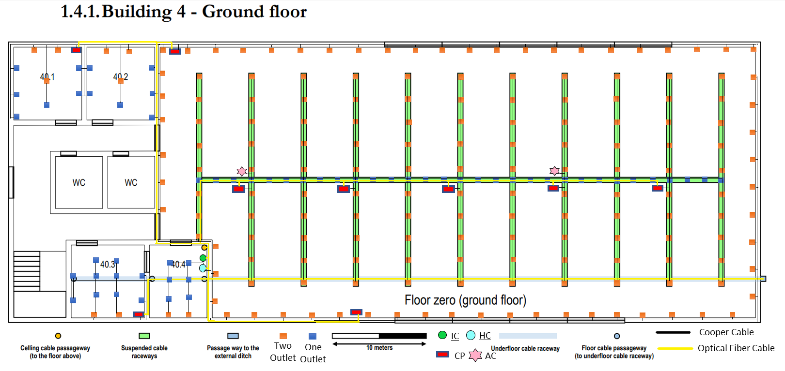
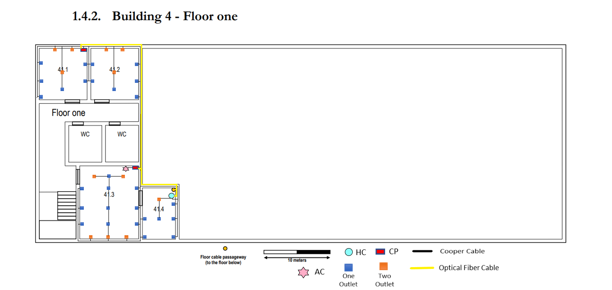

RCOMP 2020-2021 Project - Sprint 1 - Member 1190778 folder
===========================================
## Edifício 4

### Medições das Plantas
## Piso 0 (Ground Floor)

### Planta do Piso 0

No piso 0 optei por usar as valetas já colocadas para passar a fibra vinda do exterior, e liguei-a a um IC na sala 40.4. A partir desse IC passei cabos de fibra para o piso de cima através de uma valeta já existente naquela sala e passei também um cabo de fibra para o HC, que também se encontrava naquela sala. Nesse HC coloquei dois patch panel de 24 portas e um switch de 48 portas, pois precisávamos de ligar la os 10 outlets daquela sala e ainda mais alguns do salão grande e esta era a solução mais viável para o fazer. No HC coloquei ainda um switch de fibra ótica para conseguir passar a fibra para 9 outros CP nas salas ao lado. Na sala 40.1 coloquei então um dos CP com dois patch panel de 24 portas e um switch de 48 portas para conseguir cobrir 24 outlets das salas 40.1 e 40.2 e ainda alguns do salão grande. Na sala 40.3 coloquei outro CP com um switch e um patch panel de 24 portas para cobrir 14 outlets. Por fim em relação ao salão grande optei por colocar bem distribuídos nas calhas existentes a maioria dos outlets desse salão de maneira a suprir as necessidades pedidas, contudo e para respeitar também a distancia dos 3 metros optei por colocar nas paredes a toda a volta da sala outlets, ficando assim a sala totalmente coberta por acesso a rede a menos de 3 metros de qualquer ponto da mesma. Optei também por colocar 7 CP em sítios estratégicos para que conseguisse cobrir todos os outlets do salão com exceção de alguns que por estarem muito mais perto do HC optei por os ligar diretamente lá. Em algumas das salas tive de colocar outlets no chão para manter a distância de 3 metros em toda a área. Neste piso optei por colocar 2 access point no salão pois eram as zonas mais centrais nas quais se podia criar uma boa área para o WI-FI, dando assim uma cobertura total da infraestrutura. Os access points estão no canal 1 e 6 para não criar overlap. Em relação à fibra passei sempre dois cabos para cumprir a redundância.

| Medidas         | C (cm)  | L (cm)  | C (m)  | L (m)  | A (m²)           | Outlets (Minimos) | Total Outlets |
|-----------------|---------|---------|--------|--------|------------------|-------------------|---------------|
| 40.1            | 1,45    | 1,55    | 7,25   | 7,75   | 56,19            | 12                | 12            |
| 40.2            | 1,45    | 1,55    | 7,25   | 7.75   | 56,19            | 12                | 12            |
| 40.3            | 1,55    | 1,55    | 7,75   | 7.75   | 60,06            | 14                | 14            |
| 40.4            | 1,2     | 1,55    | 6,0    | 7,75   | 46,5             | 10                | 10            |
| Salão (Pequeno) | 1,1     | 4,1     |  5.5   | 20,5   | 112.75           | (não conta)       | (não conta)   |
| Salão (Grande)  | 11,6    | 5,75    |  58    | 28,75  | 1667.5           | (não conta)       | (não conta)   |
| Salão (Total)   |         |         |        |        | Pequeno + Grande | 358               | 365           |
| Total           | 18.35   | 16.05   | 91.75  | 80.25  | 1999.19          | 406               | 413           |

### Inventário Piso 0

#### Sala 40.1

* 1 CP
    * 2 Patch Panel de 24 portas com 2 entradas de fibra ótica (no total);
    * 1 Switch de 48 portas com 2 entrada de fibra ótica;
* 88.75 metros de cabo de cobre CAT7;
* 12 outlets;
* 1 Telecommunication Enclosures de 6U;
* 38 Patch Cords (36 de cobre + 2 de fibra) de 0.5m cada um (19m total);

#### Sala 40.2

* 106.75 metros de cabo de cobre CAT7;
* 12 outlets;

#### Sala 40.3

* 1 CP
    * 1 Patch Panel de 24 portas com 2 entradas de fibra ótica;
    * 1 Switch de 24 portas com 2 entrada de fibra ótica;
* 150.50 metros de cabo de cobre CAT7;
* 14 outlets;
* 1 Telecommunication Enclosures de 6U;
* 16 Patch Cords (14 de cobre + 2 de fibra) de 0.5m cada um (8m total);

#### Sala 40.4

* 1 IC
* 1 HC
    * 1 Patch Panel de fibra ótica de 24 portas;
    * 1 Switch de fibra ótica de 24 portas; 	
    * 2 Patch Panel de 24 portas com 2 entradas de fibra ótica (no total);
    * 1 Switch de 48 portas 2 Patch Panel de 24 portas com 2 entradas de fibra ótica;  
* 49.75 metros de cabo de cobre CAT7;
* 10 outlets;
* 1 Telecommunications Enclosures de 12U;
* 62 Patch Cords (44 de cobre + 18 de fibra) de 0.5m cada um (31m total);

#### Salão Grande

* 7 CP
    * 14 Patch Panel de 24 portas com 2 entradas de fibra ótica;
    * 7 Switch de 48 portas com 2 entrada de fibra ótica;  
* 3643.75 metros de cabo de cobre CAT7;
* 365 outlets;
* 7 Telecommunications Enclosures de 6U cada um;
* 2 AC;
* 336 Patch Cords (322 de cobre + 14 de fibra) de 0.5m cada um (168m total);

### Inventário Global do Piso 0

* 1 IC
* 1 HC
    * 1 Patch Panel de fibra ótica de 24 portas;
    * 1 Switch de fibra ótica de 24 portas; 	
    * 2 Patch Panel de 24 portas com 2 entradas de fibra ótica (no total);
    * 1 Switch de 48 portas 2 Patch Panel de 24 portas com 2 entradas de fibra ótica;  
* 9 CP
    * 17 Patch Panel de 24 portas com 2 entradas de fibra ótica cada um;
    * 8 Switch de 48 portas com 2 entrada de fibra ótica;
    * 1 Switch de 24 portas com 2 entrada de fibra ótica;
* 357.50 metros de cabo de fibra ótica monomodo;
* 4039.50 metros de cabo de cobre CAT7;
* 365 Outlets;
* 2 Access Point;
* 10 Telecommunications Enclosures (9 de 6U e 1 de 12U).
* 452 Patch Cords (416 de cobre + 36 de fibra) de 0.5m cada um (226m total);

## Piso 1 (Floor One)

## Planta do Piso 1

No piso 1 optei por usar as valetas já colocadas para passar a fibra vinda do piso de baixo, e liguei-a a um HC na sala 41.4. Nesse HC coloquei um patch panel e um switch de 24 portas, pois precisávamos de ligar la os 8 outlets daquela sala. No HC coloquei ainda um switch de fibra ótica para conseguir passar a fibra para 2 outros CP nas salas ao lado. Na sala 41.1 coloquei então um dos CP com dois patch panel de 24 portas e um switch de 48 portas para conseguir cobrir 24 outlets das salas 41.1 e 41.2. Na sala 41.3 coloquei outro CP com um switch e um patch panel de 24 portas para cobrir 20 outlets dessa sala e ainda um acess point. Em algumas das salas tive de colocar outlets no chão para manter a distância de 3 metros em toda a área. Neste piso optei por colocar 1 access point na sala 41.3 pois era a zona mais central nas quais se podia criar uma boa área para o WI-FI, dando assim uma cobertura total da infraestrutura e também porque não estava diretamente em cima dos access point do piso inferior. O access point está no canal 11 para não criar overlap mesmo em relação aos do piso inferior. Em relação à fibra passei sempre dois cabos para cumprir a redundância.

| Medidas         | C (cm)  | L (cm)  | C (m)  | L (m)  | A (m²)           | Outlets (Minimos) | Total Outlets |
|-----------------|---------|---------|--------|--------|------------------|-------------------|---------------|
| 41.1            | 1,45    | 1,55    | 7,25   | 7,75   | 56,19            | 12                | 12            |
| 41.2            | 1,45    | 1,55    | 7,25   | 7,75   | 56,19            | 12                | 12            |
| 41.3            | 1,8     | 2,2     | 9,0    | 11,0   | 99,0             | 20                | 20            |
| 41.4            | 1,0     | 1,5     | 5,0    | 7,5    | 37,5             | 8                 | 8             |
| Total           |         |         |        |        | 248.88           | 52                | 52            |

### Inventário Piso 1

#### Sala 41.1

* 1 CP
    * 2 Patch Panel de 24 portas com 2 entradas de fibra ótica (no total);
    * 1 Switch de 48 portas;
* 88.75 metros de cabo de cobre CAT7;
* 12 outlets;
* 1 Telecommunication Enclosures de 6U;
* 26 Patch Cords (24 de cobre + 2 de fibra) de 0.5m cada um (13m total);

#### Sala 41.2

* 106.75 metros de cabo de cobre CAT7;
* 12 outlets;

#### Sala 41.3

* 1 CP
    * 1 Patch Panel de 24 portas com 2 entradas de fibra ótica;
    * 1 Switch de 24 portas com 2 entrada de fibra ótica;
* 404.50 metros de cabo de cobre CAT7;
* 20 outlets;
* 1 Telecommunications Enclosures de 6U;
* 1 Acess Point;
* 23 Patch Cords (21 de cobre + 2 de fibra) de 0.5m cada um (11,5m total);

#### Sala 41.4

* 1 HC
    * 1 Patch Panel de fibra ótica de 12 portas;
    * 1 Switch de fibra ótica de 12 portas; 	
    * 1 Patch Panel de 24 portas;
    * 1 Switch de 24 portas;  
* 41.5 metros de cabo de cobre CAT7;
* 8 outlets;
* 1 Telecommunications Enclosures de 6U;
* 12 Patch Cords (8 de cobre + 4 de fibra) de 0.5m cada um (6m total);

### Inventário Global do Piso 1

* 1 HC
    * 1 Patch Panel de fibra ótica de 12 portas;
    * 1 Switch de fibra ótica de 12 portas; 	
    * 1 Patch Panel de 24 portas;
    * 1 Switch de 24 portas;   
* 2 CP
    * 3 Patch Panel de 24 portas com 2 entradas de fibra ótica;
    * 1 Switch de 48 portas com 2 entrada de fibra ótica;
    * 1 Switch de 48 portas com 2 entrada de fibra ótica;
* 78 metros de cabo de fibra ótica monomodo;
* 641.50 metros de cabo de cobre CAT7;
* 52 Outlets;
* 1 Access Point;
* 3 Telecommunications Enclosures todos de 6U.
* 61 Patch Cords (53 de cobre + 8 de fibra) de 0.5m cada um (30,5m total);
