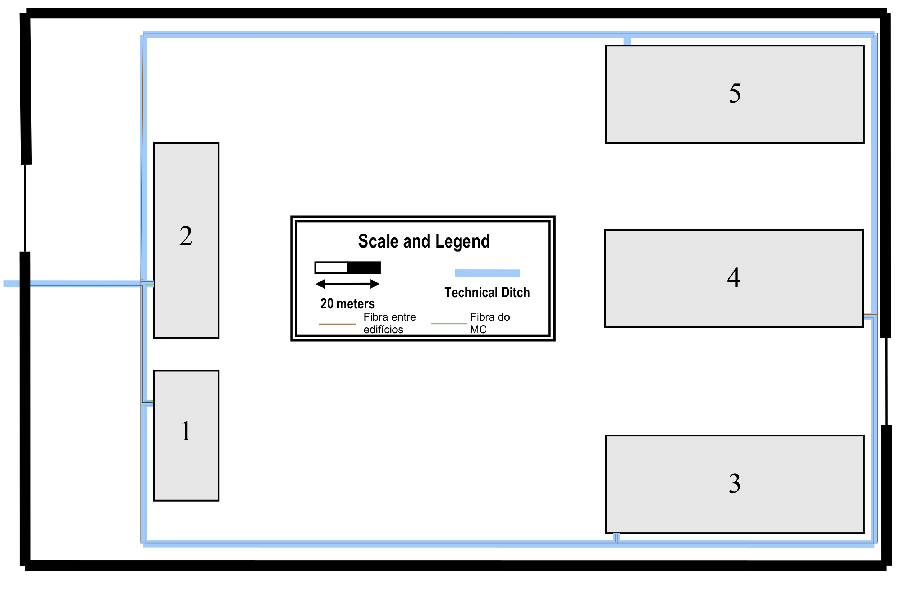
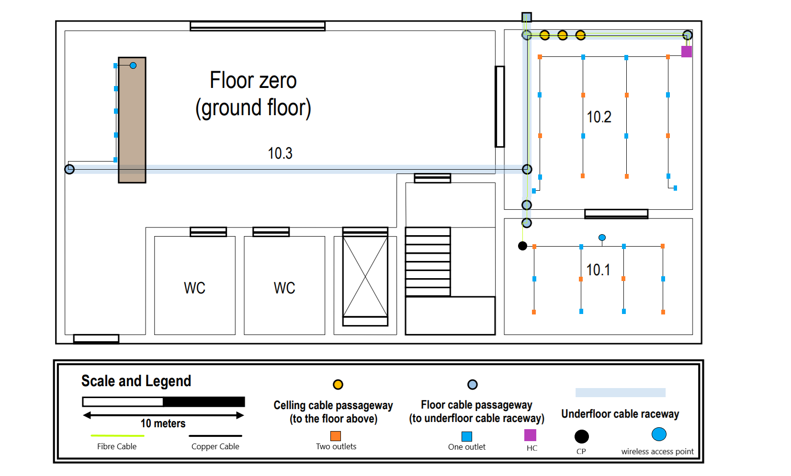
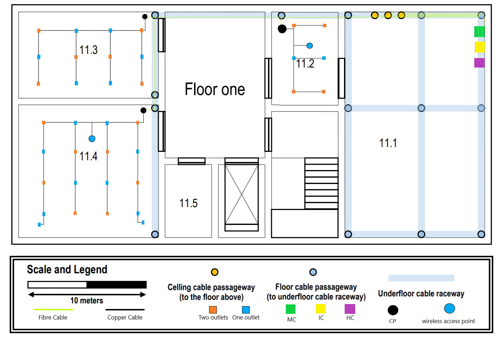

RCOMP 2020-2021 Project - Sprint 1 - Member 1190780 folder
===========================================

## Campus

Nesta imagem o cabo representado a preto é o cabo que vem do exterior(operadora) e que vai para o MC(Main Cross Connect) que se situa no edifício 1. Depois, a partir deste edifício são distribuídos cabos de duas maneiras. Uma, representada a verde, vai ligar o MC a cada IC(Intermediate Cross Connect) de cada edifício. A outra, representada a castanho, feita também por ligações de fibra ótica, vai ligar o edifício o 1 ao 3, o 3 ao 4, 4 ao 2 e 2 ao 1. Esta outra forma é efetuada para garantir a redundância. No total são utilizados 1250 metros de fibra ótica monomodo.

## Edifício 1

## Piso 0 (Ground Floor)

Neste edifício é onde se vai encontrar o MC. Logo na piso 0 existe um ponto de entrada e saída de fibra ótica que passa os cabos para o piso de cima(onde se vai encontrar o MC). Existe também uma passagem de fibra ótica do piso de cima para o de baixo que vem do IC e liga ao HC(representado a roxo) na sala 10.2 . Este HC contém 2 patch panels de 24 portas e um switch de 48 portas correspondente pois pois precisavamos de ligar a 31 outlets, 1 access point e 1 CP. O HC contém também um switch de fibra ótica, bem como um patch panel de fibra ótica para poder enviar os cabos aos CP. Na sala 10.2 coloquei o número recomendado de outlets em relação à sua área e efetuei a sua disposição de modo a que em praticamente todos os pontos da sala, existem sempre pelo menos 2 outlets acessíveis 3 metros ou menos. Existe sempre no mínimo 1 disponivel a 3 metros em qualquer ponto da sala. A sala 10.1 recebe o cabo do HC através das valetas debaixo do piso e este vai ter a um CP. O CP contém um switch e um patch panel de 24 portas pois precisa de cobrir 18 outlets e um access point. Nesta sala os outlets estão dispostos de maneira a que em todos os pontos existam pelo menos 2 outlets disponíveis a 3 metros. A sala 10.3 recebe os cabos do HC também pelas valetas debaixo do piso. estes cabos vão dar aos 5 outlets à beira da secretária(como pedido) e a um access point. Neste piso os access points estão dispostos desta maneira pois permitem uma total cobertura do piso, e de modo a tentar evitar que aconteça overlapping com os AP do andar de cima. O AP da sala 10.3 está no canal 1 e o da sala 10.1 está no canal 6. Todas as ligações feitas através de cabos de fibra ótica tem 2 cabos para cumprir a redundância.

#### Medições das  Planta:

| Sala | Ci (cm) | Li (cm) | Cr (m) | Lr (m) | A (m²) | Outlets minimo |Outlets|
|---------|---------|---------|--------|--------|--------|---------||
| Total | 15,30   | 7,60    | 40     | 20     |  800   |     |49|
| 10.1    | 4,4    | 2,7    | 11,58     | 7,11      | 82,33     | 18      |18|
| 10.2    | 4,4    | 4,2     | 11,58     | 11,05     | 127,96    | 26      |26|
| 10.3    | 0       | 0       | 0      | 0      | 326,91      | 0       | 5|

#### Inventário
  * 1 HC:
   * 1 Switch fibra ótica 12 portas
   * 1 Switch 48 Portas
   * 1 Patch Panel fibra 12 Portas
   * 2 Patch Panel 24 portas
   * 1 Telecomunication Enclosure de 12U
  * 1 CP:
   * 1 Switch 24 portas
   * 1 Patch Panel 24 portas
   * 1 Telecomunication Enclosure de 6U
  * 49 outlets
  * 53 Patch Cords(total 26,5 metros)
  * 570 metros de cabo Cat7
  * 110 metros de cabo de fibra ótica monomodo
  * 2 Access Points

## Piso 1

Neste piso é onde se vai encontrar o MC, o IC e um HC. Por isso vem cabos de fibra ótica do andar de baixo(vindos do exterior) que vão ter ao MC(verde). Do MC saem cabos de fibra para o IC(amarelo) e de novo para o exterior para ser feita a distribuição pelos restantes edifícios. Do IC saem cabos de fibra para o HC(roxo) deste piso e para o HC do piso abaixo. O HC, IC e MC deste piso encontram-se representados desta forma na imagem apenas para termos esquemáticos pois todos partilharão a mesma Telecommunication Enclosure(no local onde se situa o MC na imagem). O HC deste piso contém um switch de fibra ótica, bem como um patch panel de fibra ótica para poder enviar os cabos aos 3 CP das outras salas. A sala 11.2 contém um CP que recebe os cabos do HC pela passagem debaixo do piso. Este CP tem um switch e um patch panel de 24 portas para cobrir os 10 outlets e o access point. A sala 11.3 contém um CP que recebe os cabos do HC. O CP contém um switch e um patch panel de 24 portas para cobrir os 18 outlets. Nesta sala os outlets encontram-se distribuidos do mesmo modo da sala 10.1 pois estas tem a mesma dimensão e configuração.
A sala 11.4 contém o 3º CP, que possui um switch de 48  portas e dois patch panels de 24 portas, que cobrem os 26 outlets e o Access Point. Os outlets desta sala encontram-se distribuidos do mesmo modo da sala 10.2 pois estas também possuem a mesma dimensão e configuração.
Neste piso os access points estão dispostos desta maneira pois permitem uma total cobertura do piso, e de modo a tentar evitar que aconteça overlapping com os AP do piso abaixo. O AP da sala 11.4 está no canal 6 e o da sala 11.2 está no canal 11.
#### Medições das  Planta:

| Medidas | Ci (cm) | Li (cm) | Cr (m) | Lr (m) | A (m²) | Outlets minimo |Outlets|
|---------|---------|---------|--------|--------|--------|---------||
| Total      | 15,27   | 7,66    | 40     | 20     | 800    |       |54|
| 11.1    | 7,2    | 4,4    | 18,95     | 11,58     | 219,44  | 44       |0|
| 11.2    | 2,95    | 2,1    | 7,76      | 5,53      | 42,91     | 10      |10|
| 11.3    | 4,45    | 2,7    | 11,71     | 7,11      | 83,26     | 18      |18|
| 11.4    | 4,45    | 4,2    | 11,71     | 11,05     | 129,40    | 26      |26|
| 11.5    | 2,3    | 1,5    | 6,05      | 3,95      | 23,90     | 6       |0|

#### Inventário

  * 1 MC
  * 1 IC
  * 1 HC:
   * 1 Switch fibra ótica 12 portas
   * 1 Patch Panel fibra 12 Portas
   * 1 Telecomunication Enclosure de 6U
  * 3 CP:
   * 2 Switch 24 portas
   * 1 Switch 48 portas
   * 4 Patch Panel 24 portas
   * 2 Telecomunication Enclosure de 6U
   * 1 Telecomunication Enclosure de 6U
  * 54 outlets
  * 62 Patch Cords(total 31 metros)
  * 320 metros de cabo Cat7
  * 220 metros de cabo de fibra ótica monomodo
  * 2 Access Points
