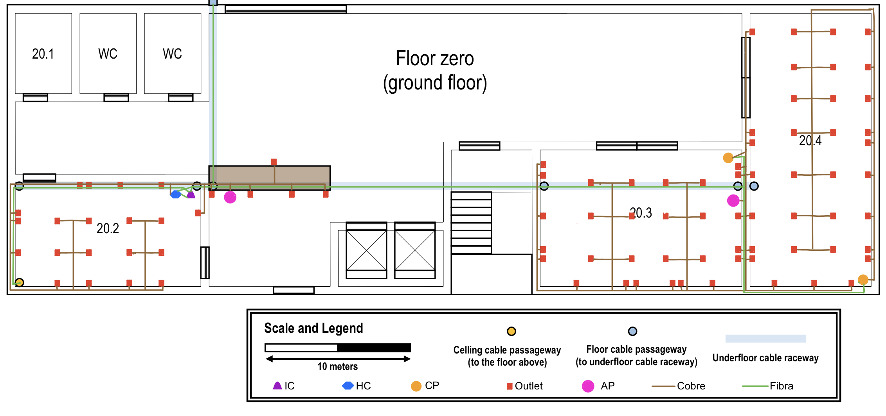
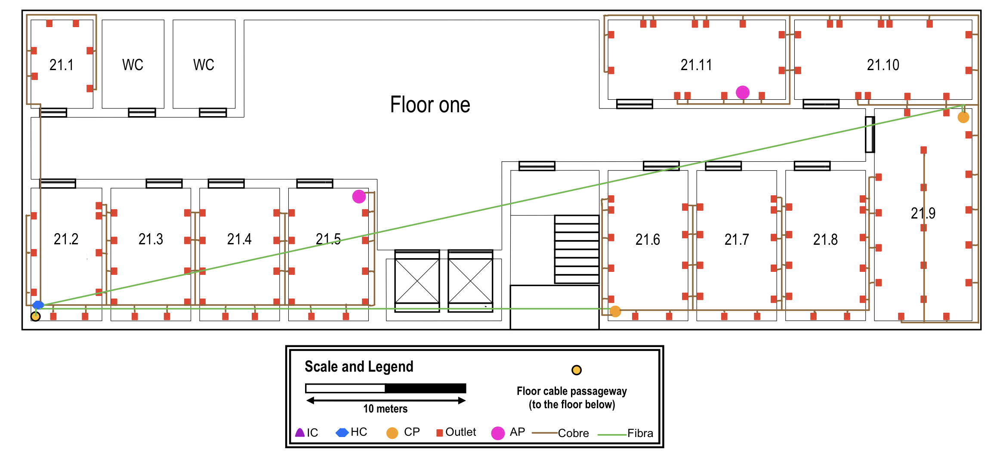

RCOMP 2019-2020 Project - Sprint 1 - Member 1190986 folder
===========================================

## Edifício 2

Neste sprint fiquei com o cargo de fazer o planeamento da rede do edifício 2.

## Piso 0

No piso 0 optei por usar as valetas já colocadas para passar a fibra do exterior, e liguei-a a um IC na sala 20.2 ao qual liguei para passar os cabos para o piso de cima e ainda liguei a um HC nessa mesma sala. Nesse HC coloquei um patch panel e um switch de 24 portas e um de 12 portas pois precisávamos de ter 25 outlets e um access point e esta era a solução com o valor mais próximo. No HC coloquei ainda um switch de fibra ótica para conseguir passar a fibra para dois outros CP nas salas ao lado.
Na sala 20.3 coloquei então um dos CP com um patch panel e um switch de 48 portas para conseguir cobrir 38 outlets e um access point e na sala 20.4 coloquei outro CP com um switch e um patch panel de 48 portas para cobrir 23 outlets. Em algumas das salas tive de colocar outlets no chão para manter a distância de 3 metros em toda a área. Neste piso optei por colocar um access point na secretária e outro na sala 20.3 pois eram as zonas mais centrais nas quais se podia criar uma boa área para o WI-FI. O access point está no canal 1 e o access point da sala 20.3 está no canal 6 para evitar o overlap da rede. Em relação à fibra passei sempre dois cabos para cumprir a redundância.

#### Medidas (Por Sala):

| Medidas | Ci (cm) | Li (cm) | Cr (m) | Lr (m) | A (m²) | Outlets |
|---------|---------|---------|--------|--------|--------|---------|
| 20      | 21,0    | 6,6     | 58,3   | 18,3   | 1066,9 | 86      |
| 20.1    | 1,4     | 1,9     | 3,9    | 5,3    | 20,7   | 0       |
| 20.2    | 4,5     | 2,6     | 12,5   | 7,2    | 90,0   | 20      |
| 20.3    | 5,0     | 3,3     | 13,9   | 9,2    | 127,9  | 28      |
| 20.4    | 3,0     | 6,7     | 8,3    | 18,6   | 154,4  | 33      |
| secretária| 3,0     | 0,6     | 8,3    | 1,7    | 14     | 5      |

#### Inventário:

* 1 Telecomunication Enclosure 12U
* 2 Telecomunication Enclosure 6U
* 1 IC
* 1 HC:
    * 1 Switch Fibra Ótica 12 Portas
    * 1 Patch Panel Fibra Ótica 12 portas
    * 1 Switch 24 portas
    * 1 Patch Panel 24 portas
    * 1 Switch 12 portas
    * 1 Patch Panel 12 portas
* 2 CP:   
    * 1 Switch 48 portas
    * 2 Patch Panel 24 portas
    * 1 Switch 48 portas
    * 2 Patch Panel 24 portas
* 86 outlets
* 94 Patch Cords com 46 metros total
* 1200 metros de cabo Cat7
* 240 metros de cabo de Fibra Ótica
* 2 Access Points

NOTA: a fibra já contém os dois cabos para a redundância

## Piso 1

No piso 1 optei por ligar a fibra que bem do piso inferior a um HC, HC esse que contém um patch panel e um switch de fibra ótica de 4 portas para passar a fibra para outros 2 CPs no piso e um patch panel e um switch de 48 portas para poder utilizar 44 outlets e um access point nas salas 21.1, 21.2, 21.3, 21.4 e 21.5. Na sala 21.6 optei por colocar um CP para poder utilizar 34 outlets na sala 21.6, 21.7, 21.8 e alguns da sala 21.9. Este CP contém um patch panel e um switch de 48 portas. Na sala 21.9 coloquei outro CP, este que liga 40 outlets nas salas 21.9, 21.10 e 21.11 e ainda um access point. Este CP contém também um patch panel e um switch de 48 portas. Neste piso optei por colocar um access point na sala 21.5 e outro na sala 21.11 pois eram zonas centrais nas quais se podia criar uma boa área para a rede WI-FI e não estavam diretamente em cima dos access point do piso inferior, ainda assim decidi colocar o access point da sala 21.5 no canal 11 e o da sala 21.11 no canal 1 para não existir overlap na rede. Em relação à fibra passei sempre dois cabos para cumprir a redundância.

#### Medidas (Por Sala):

| Medidas | Ci (cm) | Li (cm) | Cr (m) | Lr (m) | A (m²) |  Outlets |
|---------|---------|---------|--------|--------|--------|---------|
| 21      | 21,0    | 6,6     | 58,3   | 18,3   | 1066,9 | 122     
| 21.1    | 1,4     | 2,0     | 3,9    | 5,6    | 21,8   | 6       
| 21.2    | 1,6     | 2,9     | 4,4    | 8,1    | 35,6   | 9       
| 21.3    | 1,8     | 2,9     | 5,0    | 8,1    | 40,5   | 10      
| 21.4    | 1,8     | 2,9     | 5,0    | 8,1    | 40,5   | 10      
| 21.5    | 1,8     | 2,9     | 5,0    | 8,1    | 40,5   | 10      
| 21.6    | 1,8     | 3,3     | 5,0    | 9,2    | 46,0   | 11      
| 21.7    | 1,8     | 3,3     | 5,0    | 9,2    | 46,0   | 11      
| 21.8    | 1,8     | 3,3     | 5,0    | 9,2    | 46,0   | 11      
| 21.9    | 2,2     | 4,7     | 6,1    | 13,0   | 79,3   | 18      
| 21.10   | 3,9     | 1,8     | 10,8   | 5,0    | 54,0   | 13      
| 21.11   | 3,9     | 1,8     | 10,8   | 5,0    | 54,0   | 13      

#### Inventário:
* 1 Telecomunication Enclosure 12U
* 1 Telecomunication Enclosure 6U
* 1 HC:
    * 1 Switch Fibra Ótica 12 Portas
    * 1 Patch Panel Fibra Ótica 12 portas
    * 1 Switch 48 portas
    * 2 Patch Panel 24 portas
* 2 CP:  
    * 2 Switch 48 portas
    * 4 Patch Panel 24 portas
* 122 outlets
* 128 Patch Cords com 63 metros total
* 2280 metros de cabo Cat7
* 220 metros de cabo de Fibra Ótica
* 2 Access Points

NOTA: a fibra já contém os dois cabos para a redundância
