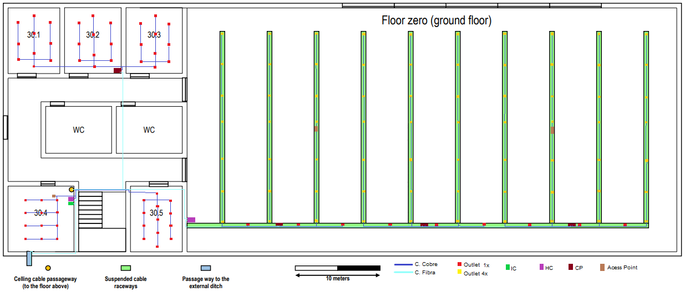
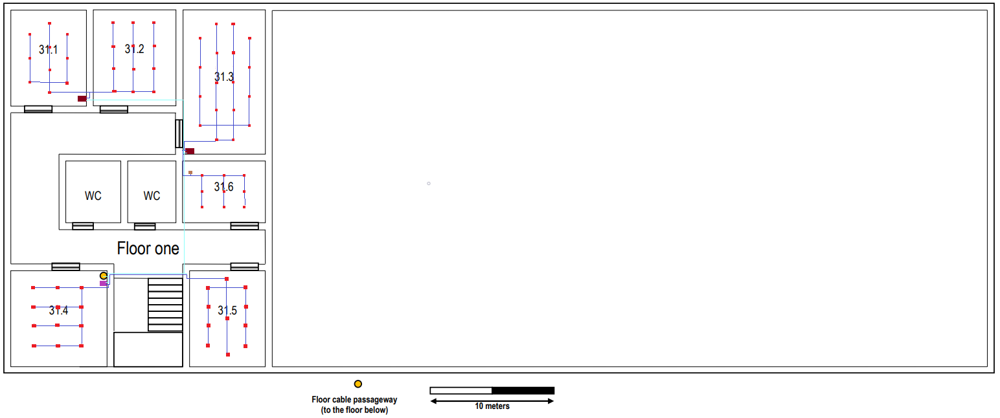

RCOMP 2019-2020 Project - Sprint 1 - Member 1191091 folder
===========================================
## Edificío 3

### Medidas

*Conversões efetuadas na Folha1 do ficheiro Excel.*

As medidas de cada sala de ambos os pisos são:

| Escala: | 2cm ⇔ 10m  |         | Real = [(imagem)*10]/2|           |        |             |
|---------|-------------|---------|--------|--------------------------|--------|-------------|
| Medidas | Ci (cm)     | Li (cm) | Cr (m) | Lr (m)                   | A (m²) | Outlets  Min|
| 30.1    | 1.2         | 1.5     | 6.0    | 7.5                      | 45.00  | 10          |
| 30.2    | 1.3         | 1.5     | 6.5    | 7,5                      | 48.75  | 10          |
| 30.3    | 1.3         | 1.5     | 6.5    | 7,5                      | 48.75  | 10          |
| 30.4    | 1.5         | 1.5     | 7.5    | 7,5                      | 56.25  | 12          |
| 30.5    | 1.2         | 1.5     | 6.0    | 7.5                      | 45.00  | 10          |
|Ground floor| 11.4     | 5.0     | 57.0   | 25.0                     | 1425   | 288         |
| 31.1    | 1.2         | 1.5     | 6.0    | 7.5                      | 45.00  | 10          |
| 31.2    | 1.3         | 1.5     | 6.5    | 7.5                      | 48.75  | 10          |
| 31.3    | 1.3         | 2.3     | 6,5    | 11,5                     | 74.75  | 16          |
| 31.4    | 1.5         | 1,5     | 7.5    | 7.5                      | 56.25  | 12          |
| 31.5    | 1.2         | 1,5     | 6.0    | 7.5                      | 45.00  | 10          |
| 31.6    | 1.3         | 1,0     | 6.5    | 5,0                      | 32.5   | 8           |

## Outlets

*Calculo efetuado na Folha2 do ficheiro Excel.*

|Sala        |A (m²)   |Outlets  Min|Outlets  Usados|
|------------|--------|-------------|-------------|
| 30.1       | 45     | 10          |10           |
| 30.2       | 48.75  | 10          |10           |
| 30.3       | 48.75  | 10          |10           |
| 30.4       | 56.25  | 12          |12           |
| 30.5       | 45     | 10          |13           |
|Ground floor| 1425   | 288         |289          |
| 31.1       | 45     | 10          |10           |
| 31.2       | 48.75  | 10          |12           |
| 31.3       | 74.75  | 16          |18           |
| 31.4       | 56.25  | 12          |12           |
| 31.5       | 45     | 10          |11           |
| 31.6       | 32.5   | 8           |9            |

## Piso 0

### Inventário Individual

*Ligações calculadas na Folha4 do ficheiro Excel.*

#### Sala 30.1
  * 10 outlets
  * 36 metros de cabo de cobre CAT7;

#### Sala 30.2
  * 10 outlets
  * 1 CP:
    * 2 Patch Panel de 24 portas (1U)
    * 1 Switch de 48 portas (1U)
  * 1 Telecommunications Enclosures (6U)
  * 30 metros de cabo de cobre CAT7
  * 31 Patch Cords / 15.5 metros de Patch Cords

#### Sala 30.3
  * 10 outlets
  * 30 metros de cabo de cobre CAT7

#### Sala 30.4
  * 12 outlets
  * 1 Acess Point
  * 1 IC
  * 1 HC:
    * 2 Patch Panel de 24 portas (1U)
    * 1 Switch de 48 portas (1U)
  * 1 Telecommunications Enclosures (6U)
  * 70 metros de cabo de cobre CAT7
  * 26 Patch Cords / 13 metros de Patch Cords

#### Sala 30.5
  * 13 outlets
  * 45 metros de cabo de cobre CAT7

#### Ground Floor
  * 289 outlets
  * 2 Acess Point
  * 1 HC:
    * 1 Patch Panel de 12 portas (1U)
    * 1 Switch de 12 portas (1U)
  * 7 CP:
    * 13 Patch Panel de 24 portas (1U)
    * 6 Switches de 48 portas (1U)
    * 1 Switch de 24 portas (1U)
  * 4 Telecommunications Enclosures (6U, 12U, 12U, 16U)
  * 4060 metros de cabo de cobre CAT7
  * 292 Patch Cords / 146 metros de Patch Cords

### Inventário de Piso Total
  * 344 outlets
  * 1 IC
  * 8 CP
  * 2 HC
  * 3 Acess Point
  * 17 Patch Panels de 24 portas (1U)
  * 8 Switches de 48 portas (1U)
  * 1 Switches de 24 portas (1U)
  * 1 Patch Panels de 12 portas (1U)
  * 1 Switches de 12 portas (1U)
  * 6 Telecommunications Enclosures
  * 291 metros de cabo de fibra ótica monomodo (145.5m +145.5m para cumprir a redundância)
  * 4271 metros de cabo de cobre CAT7
  * 349 Patch Cords / 175 metros de Patch Cords

## Piso 1

### Inventário Individual

#### Sala 31.1
  * 10 outlets
  * 1 CP:
    * 1 Patch Panel de 24 portas (1U)
    * 1 Switch de 24 portas (1U)
  * 1 Telecommunications Enclosures (2U)
  * 53 metros de cabo de cobre CAT7
  * 22 Patch Cords / 11 metros de Patch Cords

#### Sala 31.2
  * 12 outlets
  * 55 metros de cabo de cobre CAT7

#### Sala 31.3
  * 18 outlets
  * 1 CP:
    * 2 Patch Panel de 24 portas (1U)
    * 1 Switch de 48 portas (1U)
  * 1 Telecommunications Enclosures (6U)
  * 140 metros de cabo de cobre CAT7
  * 28 Patch Cords / 14 metros de Patch Cords

#### Sala 31.4
  * 12 outlets
  * 1 HC:
    * 2 Patch Panel de 24 portas (1U)
    * 1 Switch de 48 portas (1U)
  * 1 Telecommunications Enclosures (6U)
  * 65 metros de cabo de cobre CAT7
  * 24 Patch Cords / 12 metros de Patch Cords

#### Sala 31.5
  * 11 outlets
  * 165 metros de cabo de cobre CAT7;

#### Sala 31.6
  * 9 outlets
  * 1 Acess Point
  * 47 metros de cabo de cobre CAT7;

### Inventário de Piso Total
  * 66 outlets
  * 2 CP
  * 1 HC
  * 1 Acess Point
  * 2 Switches de 48 portas (1U)
  * 5 Patch Panels de 24 portas (1U)
  * 1 Switches de 24 portas (1U)
  * 3 Telecommunications Enclosures
  * 100 metros de cabo de fibra ótica monomodo (50m + 50m para cumprir a redundância)
  * 525 metros de cabo de cobre CAT7
  * 74 Patch Cords / 37 metros de Patch Cords

## Inventário Total Edifício
  * 406 outlets
  * 1 IC
  * 3 HC
  * 10 CP
  * 4 Acess Point
  * 10 Switches de 48 portas (1U)
  * 22 Patch Panels de 24 portas (1U)
  * 2 Switches de 24 portas (1U)
  * 1 Patch Panels de 12 portas (1U)
  * 1 Switches de 12 portas (1U)
  * 9 Telecommunications Enclosures
  * 391 metros de cabo de fibra ótica monomodo
  * 4271 metros de cabo de cobre CAT7
  * 424 Patch Cords / 212 metros de Patch Cords
